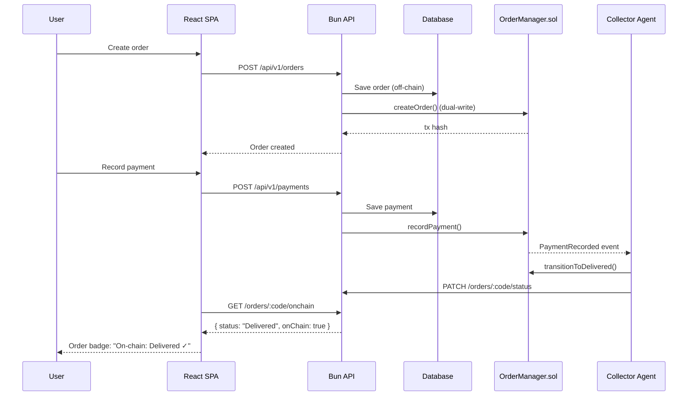

# eclick One — Agentic Commerce Network

eclick One es una plataforma de operaciones de comercio electrónico para Panamá que ha evolucionado de una aplicación académica centralizada a una **Agentic Commerce Network**: una red descentralizada donde agentes de IA autónomos gestionan operaciones comerciales, con smart contracts como fuente de verdad inmutable.

## Arquitectura

```
apps/
  api/          Bun REST API: routes → controllers → services → repositories + dual-write on-chain
  web/          React + Vite SPA con Web3 dashboard y on-chain status
  agents/       AI agents autónomos (Collector, Compliance) con wallet propio
  contracts/    Smart contracts Solidity (Foundry): OrderManager, PaymentLedger
packages/
  domain/       Entidades, reglas de negocio puras, contratos de repositorio (cero dependencias)
  db/           Repositorios Mock, Turso, Azure SQL
  shared/       Helpers de entorno y utilidades compartidas
docs/
  db-contract.md  Contrato de superficie SQL esperada
  deployment-guide.md  Runbook de despliegue para local, staging y producción
```

El flujo de dependencias es hacia adentro: las aplicaciones y adaptadores dependen de `@eclick-one/domain`; el paquete domain no tiene dependencias externas.

### Diagrama de Arquitectura

```mermaid
flowchart LR
  Browser[Browser] --> Web[React + Vite SPA]
  Web -->|/api/v1/*| Api[Bun REST API]
  Api --> Services[Commerce Service]
  Services --> Domain[Pure domain rules]
  Services --> Repos{Repository}
  Repos -->|mock| Mock[In-memory mock]
  Repos -->|turso| Turso[Turso DB]
  Services --> OnChain[OnChainClient]
  OnChain -->|Dual-write| Contract[Smart Contracts<br/>OrderManager / PaymentLedger]
  Contract --> Anvil[Anvil &#40;Local Chain 31337&#41;]
  Agents[AI Agents] -->|Listen / Write| Contract
  Agents -->|Status Sync| Api
  Agents -->|HTTP API| Web
```



## Stack Tecnológico

| Capa | Tecnología |
|------|-----------|
| Runtime | Bun 1.3 |
| Frontend | React 19, Vite 8, Tailwind CSS 4, Apache ECharts 6 |
| Backend | Bun HTTP server (router propio) |
| Smart Contracts | Solidity 0.8.28 + Foundry (forge, anvil, cast) |
| Web3 Client | viem 2.x |
| AI Agents | Bun processes autónomos con wallet propia |
| DB (mock) | In-memory JavaScript |
| DB (real) | Turso (libSQL) / Azure SQL (mssql) |
| Testing | Bun test + Forge test |

## Smart Contracts

### OrderManager.sol
Maneja la máquina de estados de órdenes on-chain:

```
None → Generated → InProcess → Delivered → Invoiced
                        ↘ Cancelled
```

**Eventos**: `OrderCreated`, `OrderStatusTransitioned`, `PaymentRecorded`
**Roles**: Owner (admin), Collector (agente autorizado)

### PaymentLedger.sol
Ledger append-only de pagos vinculados a órdenes on-chain.

**Contratos deployados** (Anvil local):
- `OrderManager`: `0x5FbDB2315678afecb367f032d93F642f64180aa3`
- `PaymentLedger`: `0xe7f1725E7734CE288F8367e1Bb143E90bb3F0512`

## AI Agents

### Collector Agent
- **Rol**: Monitorea eventos `PaymentRecorded` en el contrato
- **Acción**: Cuando detecta un pago en una orden en estado `InProcess`, transiciona a `Delivered` on-chain y sincroniza con la API off-chain
- **Wallet**: Account #1 de Anvil (`0x7099797...`)
- **Puerto**: 3100

### Compliance Agent
- **Rol**: Monitorea eventos `OrderStatusTransitioned` y valida contra las reglas de negocio
- **Acción**: Verifica que cada transición de estado sea válida según la máquina de estados. Reporta violaciones y discrepancias on-chain vs off-chain
- **Puerto**: 3101 (read-only, sin firma de txs)

## Frontend Routes

| Route | Purpose |
|-------|---------|
| `/` | Public landing page |
| `/app` | Operations dashboard (with Agent Activity panel) |
| `/app/customers` | Customer management |
| `/app/orders` | Orders (with on-chain status badges) |
| `/app/payments` | Payment registration |
| `/app/products` | Product catalog |
| `/app/inventory` | Stock view |
| `/app/reports` | Operational reports |
| `/app/web3` | **Web3 dashboard**: agent status, metrics, contract info, on-chain lookup |

## Requisitos

- [Bun](https://bun.sh/) 1.3+
- [Foundry](https://book.getfoundry.sh/) (forge, anvil, cast)
- Turso o Azure SQL solo si no se usa modo mock

## Desarrollo Local

### Rápido (solo mock, sin Web3)

```bash
cp .env.example .env
bun install
bun run dev
# Web: http://localhost:5173 | API: http://localhost:3000
```

### Docker Compose (stack completo)

```bash
cp .env.example .env
docker compose up --build
# Web: http://localhost | API: http://localhost:3000 | Anvil: http://localhost:8545
```

El compose levanta Anvil, despliega los contratos locales, inicia la API, sirve la SPA compilada con Nginx y ejecuta los agentes Collector y Compliance. Por defecto usa `REPOSITORY_MODE=mock`; para Turso, exporta `REPOSITORY_MODE=turso`, `TURSO_DATABASE_URL` y `TURSO_AUTH_TOKEN` antes de ejecutar `docker compose up --build`.

Los servicios `api`, `collector-agent` y `compliance-agent` montan sus fuentes en modo solo lectura y corren con `bun --watch`, lo que permite iterar durante desarrollo sin reconstruir la imagen en cada cambio. Para reiniciar desde cero:

```bash
docker compose down --remove-orphans
docker compose up --build
```

### Demo guiada con datos semilla

El modo `mock` ahora incluye un dataset demo más amplio para ventas, pagos, inventario, provincias y estados de órdenes. Sobre esa base, el repositorio trae dos scripts para dejar una demo lista para mostrar sin carga manual.

```bash
bun run demo:walkthrough
```

Ese flujo:

- levanta `anvil`, contratos, API, frontend y ambos agentes con `docker compose`
- espera a que los health checks respondan
- ejecuta `bun run demo:seed` para registrar un operador demo y completar escenarios API-driven adicionales
- deja la URL del frontend lista para abrir

Si ya tienes la stack arriba, puedes ejecutar solo el seed:

```bash
bun run demo:seed
```

Variables útiles:

- `DEMO_API_URL` para apuntar el seed a otra API distinta de `http://localhost:3000/api/v1`
- `DEMO_WEB_URL` para personalizar la URL del frontend que abre el walkthrough
- `DEMO_SEED_EMAIL` y `DEMO_SEED_PASSWORD` para sobrescribir las credenciales demo

Credenciales por defecto de la demo:

- Usuario: `demo.operator@eclick.one`
- Password: `DemoSeedPassword-2026`

Escenarios incluidos en la demo:

- catálogo con 20 productos y cobertura multi-provincia
- clientes en paz y salvo y no paz y salvo
- órdenes en `generado`, `proceso`, `entregado`, `facturado` y `cancelado`
- pagos registrados y pedidos en riesgo para enseñar dashboard y reportes
- tres órdenes reproducibles creadas por script para mostrar onboarding, lifecycle y cancelación

### Completo (con Web3 + AI Agents)

```bash
# Opción 1: Todo en un comando
bun run dev:full

# Opción 2: Paso a paso
bun run dev:anvil                          # Terminal 1: blockchain local
source ~/.foundry/bin/foundryup
forge script script/Deploy.s.sol \
  --broadcast --rpc-url http://localhost:8545 \
  --private-key 0xac0974bec39a17e36ba4a6b4d238ff944bacb478cbed5efcae784d7bf4f2ff80
cast send 0x5FbDB2315678afecb367f032d93F642f64180aa3 \
  "addCollector(address)" 0x70997970C51812dc3A010C7d01b50e0d17dc79C8 \
  --private-key 0xac0974bec39a17e36ba4a6b4d238ff944bacb478cbed5efcae784d7bf4f2ff80 \
  --rpc-url http://localhost:8545
bun run dev:api                            # Terminal 2: API
bun --cwd apps/agents dev                  # Terminal 3: Collector Agent
bun --cwd apps/agents dev:compliance       # Terminal 4: Compliance Agent
bun run dev:web                            # Terminal 5: Frontend
```

### Comandos útiles

```bash
bun run dev:web              # Solo frontend
bun run dev:api              # Solo API
bun run dev:anvil           # Blockchain local (Anvil)
bun run dev:deploy           # Deploy contratos a Anvil
bun --cwd apps/agents dev           # Collector Agent
bun --cwd apps/agents dev:compliance # Compliance Agent
bun run typecheck            # TypeScript type checking
bun test                     # Tests Bun (API + domain)
forge test                   # Tests Solidity (contratos)
bun run build                # Build de producción
```

## Flujo End-to-End (PoC)



## Licencia

MIT © 2026 Jhuomar Boskoll Quintero
