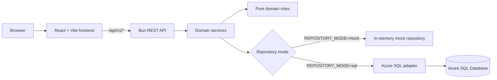
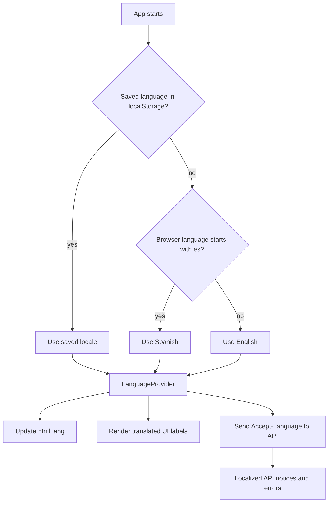
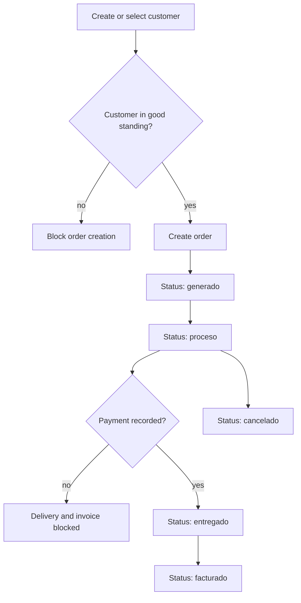

# eclick One

eclick One is an academic/professional web application for e-commerce operations in Panama. It separates the public project presentation from the internal operations console and supports both clearly identified synthetic mock data and the supplied Azure SQL Database backend.

## Architecture

```text
apps/
  api/       Bun REST API: routes -> controllers -> services -> repositories
  web/       React + Vite single-page application (the runnable frontend)
packages/
  domain/    Entities, pure business rules, and repository contracts
  db/        Mock repositories and an Azure SQL adapter using mssql
  shared/    Environment and shared utility helpers
docs/
  db-contract.md  Expected external SQL surface
```

The dependency direction is inward: applications and database adapters depend on `@eclick-one/domain`; the domain package has no framework or database dependency. Services consume repository interfaces, so changing `REPOSITORY_MODE=mock` to `sql` does not change service code.

`apps/web` renders a public landing page and an internal operations console through Vite. React Router owns the URL, while the console keeps the existing API-backed features and `/api` development proxy. The landing page is static and does not require the database or API to load.



## Frontend routes

| Route | Purpose |
| --- | --- |
| `/` | Public landing page for eclick One |
| `/app` | Internal operations home (dashboard) |
| `/app/customers` | Customer management and preferences |
| `/app/orders` | Order creation and status transitions |
| `/app/payments` | Payment registration and history |
| `/app/products` | Product catalog |
| `/app/inventory` | Stock and replenishment view |
| `/app/reports` | Operational reports |

The landing page is independent of persistence and presents the product scope, architecture, business rules, and Azure SQL readiness. The internal console consumes the REST API; each feature exposes a clear loading, empty, error, and retry state. The UI is English-first, detects the browser language on first load, persists the user's manual language choice, and provides a Spanish option. The shell displays `Synthetic data` / `Not connected to Azure SQL` in mock mode and changes to `Connected to Azure SQL` when the API health endpoint reports SQL repositories.

```mermaid
flowchart TD
  Root[/ /] --> Landing[Public Landing Page]
  Landing --> AppEntry[/app]
  AppEntry --> Dashboard[Operations Dashboard]
  Dashboard --> Customers[/app/customers]
  Dashboard --> Orders[/app/orders]
  Dashboard --> Payments[/app/payments]
  Dashboard --> Products[/app/products]
  Dashboard --> Inventory[/app/inventory]
  Dashboard --> Reports[/app/reports]
  Unknown[Unknown route] --> NotFound[Not Found Page]
```

## Localization flow



## Operations flow



## Requirements

- [Bun](https://bun.sh/) 1.3 or later
- Azure SQL Database credentials only when using the SQL repository mode

## Local development

```bash
cp .env.example .env
bun install
bun run dev
```

The web application runs at `http://localhost:5173` and proxies `/api` to the API at `http://localhost:3000`. The default example uses synthetic records; SQL mode uses the configured Azure SQL repository.

Useful commands:

```bash
bun run dev:web
bun run dev:api
bun run typecheck
bun test
bun run build
```

## Azure SQL preparation

Set `REPOSITORY_MODE=sql` and provide the `AZURE_SQL_*` variables from `.env.example`. The adapter uses encrypted transport, disables trust of unverified server certificates, applies configurable 120-second connection/request timeouts, reads the supplied `dbo` tables/views, and delegates business writes to the documented stored procedures in [docs/db-contract.md](docs/db-contract.md). It fails fast when required configuration is missing and opens the connection pool lazily.

The database owner must reconcile the proposed SQL names and columns before SQL mode is enabled. Do not commit real credentials or production/customer data.

## Technical reference for development agents

The `.context/` directory at the project root contains the complete technical and functional reference for this project. It is intended for Codex, OpenCode, or any other development agent to quickly understand the system architecture, business rules, domain model, API contracts, and development roadmap. Read the files in that directory before making changes.

## Current scope and limitations

- CRUD workflows, authentication, authorization, migrations, and complete business transactions are deferred.
- SQL identifiers are database-generated; mock identifiers simulate the same minimum ranges.
- The exact meaning of the stated "monthly rule" exception is not available. The domain exposes an explicit `monthlyRuleApplies` input instead of silently inventing the policy.
- Dates are ISO-8601 timestamps. The domain compares instants in UTC; a future localization layer should explicitly apply Panama (`America/Panama`) business-day semantics where required.
- Optional Mastra/OpenRouter settings are isolated from the primary execution path.
