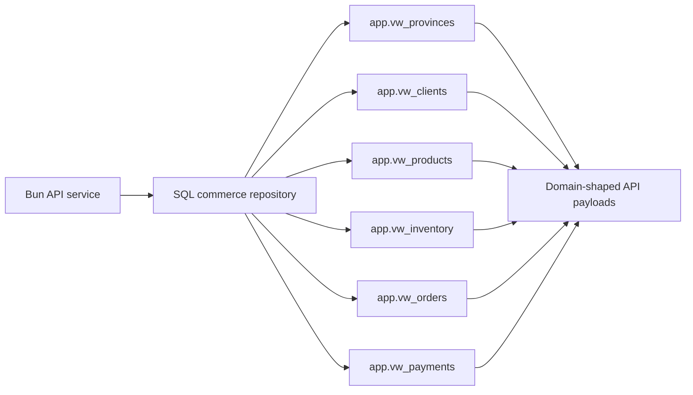
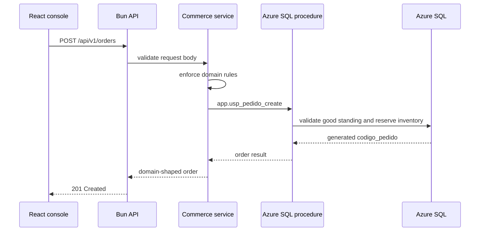

# Azure SQL Consumption Contract

Status: proposed application contract for review with the database owner. The application does not manage migrations in this phase. Azure SQL remains the persistence target; the backend can run in `mock` mode but must expose the same contract.

## Language Decision

- Internal TypeScript code and REST endpoints: English (`/api/v1/customers`, `/api/v1/products`, `/api/v1/inventory`, `/api/v1/orders`, `/api/v1/payments`). The `/api/v1/clientes` alias may remain only for academic consumption if needed.
- Visible UI and documentation: English first, with Spanish alternatives.
- Business values and domain fields: keep the academic statement and ER model names where they are part of the contract.

## Design Rules

- Azure SQL generates `codigo_cliente` from `1` and `codigo_producto` from `1000`.
- `fecha_pedido` cannot be in the future and cannot be earlier than `2024-12-29`.
- Official order statuses are exactly: `generado`, `proceso`, `entregado`, `cancelado`, `facturado`.
- Payments are preserved as append-only history. Corrections must be represented as reversal/replacement records, not destructive updates.
- Address belongs to the order as a snapshot; it must not be inferred from the client.
- SQL dates: `datetime2` or `datetimeoffset`; the API serializes ISO-8601.
- SQL amounts: `decimal`, never `float`/`real`.
- Application access must use least privilege and encrypted transport.

## Views Required By The SQL Adapter

### `app.vw_provinces`

| Column | Suggested SQL type | Notes |
| --- | --- | --- |
| `code` | `char(2)` | Stable province code |
| `name` | `nvarchar(80)` | Visible name |

The API maps this view to `id`, `codigo`, `nombre`, `prefijo`.

### `app.vw_clients`

| Column | Suggested SQL type | Notes |
| --- | --- | --- |
| `codigo_cliente` | `int` | Database-generated, minimum `1` |
| `nombre` | `nvarchar(80)` | Client first name |
| `apellido` | `nvarchar(80)` | Client last name |
| `identificacion` | `nvarchar(32)` | Cedula/RUC or another academic identifier |
| `provincia_codigo` | `char(2)` | Province reference |
| `provincia_nombre` | `nvarchar(80)` | Province name for read payloads |
| `provincia_prefijo` | `char(2)` | Prefix used in orders |
| `tipo_tarjeta` | `char(2)` | `DB` or `CR` |
| `paz_y_salvo` | `bit` | Must be `1` to generate orders |

`email`, `phone`, `balance`, and similar fields are not required by the academic model. If added later, they must remain optional extensions and must not replace `paz_y_salvo`.

### `app.vw_products`

| Column | Suggested SQL type | Notes |
| --- | --- | --- |
| `codigo_producto` | `int` | Database-generated, minimum `1000` |
| `nombre` | `nvarchar(160)` | Product name |
| `categoria` | `nvarchar(80)` | Product category |
| `activo` | `bit` | Optional for UI; not an academic rule |

`unit_price` is not required; order amount is exposed as a `monto` snapshot.

### `app.vw_inventory`

| Column | Suggested SQL type | Notes |
| --- | --- | --- |
| `codigo_producto` | `int` | Product reference |
| `cant_ventas` | `int` | Sold quantity |
| `cant_bodega` | `int` | Warehouse stock |
| `cant_reservado` | `int` | Reserved quantity |
| `nivel_reposicion` | `int` | Optional visual alert threshold |

### `app.vw_orders`

| Column | Suggested SQL type | Notes |
| --- | --- | --- |
| `codigo_pedido` | `nvarchar(64)` | Order identifier; must respect province prefix when applicable |
| `codigo_cliente` | `int` | Client reference |
| `codigo_producto` | `int` | Product reference |
| `cantidad` | `int` | Positive integer |
| `monto` | `decimal(19,4)` | Monetary snapshot |
| `etiqueta` | `nvarchar(80)` | Academic/operational order label |
| `direccion` | `nvarchar(500)` | Delivery address snapshot |
| `fecha_pedido` | `datetimeoffset` | `>= 2024-12-29` and not future |
| `fecha_entrega` | `datetimeoffset` | Nullable |
| `estado` | `varchar(20)` | `generado`, `proceso`, `entregado`, `cancelado`, `facturado` |
| `tipo_duracion` | `nvarchar(40)` | Academic duration classification |
| `pagado` | `bit` | Optional derivative from payment history |

### `app.vw_payments`

| Column | Suggested SQL type | Notes |
| --- | --- | --- |
| `id_pago` | `bigint` | Immutable history key |
| `codigo_pedido` | `nvarchar(64)` | Order reference |
| `monto_pagado` | `decimal(19,4)` | Positive amount |
| `fecha_pago` | `datetimeoffset` | Payment instant |
| `tipo_tarjeta` | `char(2)` | `DB` or `CR` |
| `referencia` | `nvarchar(128)` | Optional; never sensitive card data |

## Proposed Transactional Procedures

They are not called by the phase-one adapter, but define the recommended boundary for future mutations:

- `app.usp_cliente_create`: validates client and returns `codigo_cliente`.
- `app.usp_producto_create`: validates product and returns `codigo_producto`.
- `app.usp_pedido_create`: validates `paz_y_salvo`, reserves inventory, stores address and order snapshot, applies prefix, and returns `codigo_pedido`.
- `app.usp_pago_record`: appends payment history and returns `id_pago`; it should be idempotent by `referencia` when present.
- `app.usp_pedido_transition`: validates `estado` transitions and dates.

Transactions should use optimistic concurrency or appropriate locks over inventory and client eligibility. Procedures should return structured error codes to separate validation, conflict, and infrastructure failures.

## Open Questions

1. Which official catalog defines `tipo_duracion`?
2. What is the definitive province code/prefix standard for `codigo_pedido`?
3. Is `fecha_entrega` always calculated 48 hours after payment, or can it come from the statement as an independent value?
4. Is day 31 excluded only from monthly reports, or does it require an additional accounting rule?
