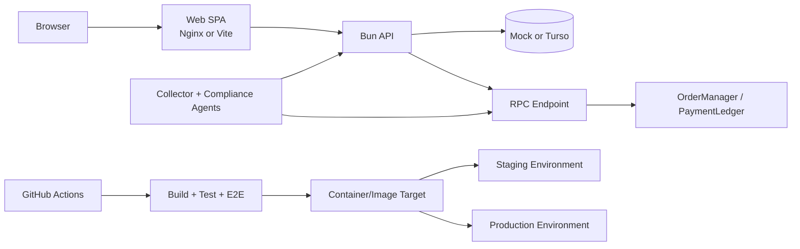

# Deployment Guide

This guide covers local development, Docker-based stacks, staging, and production deployment for `eclick-One`.

## 1. Architecture Overview

### Component map

- `apps/web`: React + Vite SPA served statically in containerized deployments
- `apps/api`: Bun HTTP API for auth, commerce operations, health, and on-chain lookups
- `apps/agents`: Collector and Compliance agents that poll the API and interact with contracts
- `apps/contracts`: Foundry project for `OrderManager` and `PaymentLedger`
- `packages/db`: repository adapters, migrations, Turso client, resilience logic
- `packages/domain`: pure business rules and repository contracts
- `packages/shared`: environment parsing, JWT helpers, shared utilities

### Runtime topology



### Default port map

| Service | Port | Notes |
|---|---:|---|
| Web | `5173` dev / `80` compose / `8080` container | Vite in dev, Nginx in container |
| API | `3000` | Exposes `/api/v1/health` |
| Anvil | `8545` | Local-only blockchain |
| Collector agent | `3100` | `/health`, `/metrics`, `/activity`, `/info` |
| Compliance agent | `3101` | `/health`, `/metrics`, `/activity`, `/info` |

## 2. Prerequisites

### Required tooling

- Bun `1.3.14+`
- Foundry (`forge`, `anvil`, `cast`)
- Docker and Docker Compose
- A Turso account if `REPOSITORY_MODE=turso`
- A domain/DNS provider and deployment target for staging or production

### Install and verify

```bash
bun --version
forge --version
anvil --version
docker --version
docker compose version
```

### Required accounts for hosted environments

- Turso
- GitHub Actions secrets management
- A hosting platform for API/web/agents
- Optional RPC provider and testnet explorer account for non-local contracts

## 3. Environment Variables

Start from the checked-in template:

```bash
cp .env.example .env
```

### Core runtime

| Variable | Required | Purpose |
|---|---|---|
| `NODE_ENV` | Yes | Runtime mode |
| `API_HOST` | Yes | API bind address |
| `API_PORT` | Yes | API port |
| `VITE_API_BASE_URL` | Yes | Frontend API base |
| `CORS_ORIGINS` | Yes | Allowed frontend origins |
| `REPOSITORY_MODE` | Yes | `mock` or `turso` |
| `JWT_SECRET` | Yes | Minimum 32-char secret |
| `JWT_ACCESS_TTL` | Yes | Access token TTL seconds |
| `JWT_REFRESH_TTL` | Yes | Refresh token TTL seconds |

### Turso

| Variable | Required when `REPOSITORY_MODE=turso` | Purpose |
|---|---|---|
| `TURSO_DATABASE_URL` | Yes | Local libSQL or hosted Turso URL |
| `TURSO_AUTH_TOKEN` | Hosted only | Turso auth token |
| `TURSO_POOL_MIN` | No | Minimum pool size |
| `TURSO_POOL_MAX` | No | Maximum pool size |
| `TURSO_CONNECTION_TIMEOUT_MS` | No | Connect timeout |
| `TURSO_QUERY_TIMEOUT_MS` | No | Query timeout |
| `TURSO_CIRCUIT_BREAKER_FAILURES` | No | Consecutive failures before open circuit |
| `TURSO_CIRCUIT_BREAKER_RESET_MS` | No | Half-open reset interval |

### On-chain and agents

| Variable | Required for Web3 stack | Purpose |
|---|---|---|
| `ONCHAIN_RPC_URL` | Yes | RPC endpoint |
| `ONCHAIN_CHAIN_ID` | Yes | Chain ID |
| `ONCHAIN_ORDER_MANAGER_ADDRESS` | Yes | OrderManager address |
| `ONCHAIN_PAYMENT_LEDGER_ADDRESS` | Yes | PaymentLedger address |
| `ONCHAIN_COLLECTOR_PRIVATE_KEY` | Collector only | Signing key for delivery transitions |
| `AGENT_PORT` | Collector | Collector HTTP port |
| `COMPLIANCE_AGENT_PORT` | Compliance | Compliance HTTP port |
| `AGENT_API_BASE_URL` | Agents | API base URL reachable by agents |
| `AGENT_POLL_INTERVAL` | Agents | Poll interval in ms |

### Recommended split by environment

```bash
.env.local
.env.staging
.env.production
```

Do not commit live secrets. Keep staged and production values in the deployment platform secret store.

## 4. Local Development

### Quick start: mock mode, no Web3

```bash
cp .env.example .env
bun install
bun run dev
```

Available endpoints:

- Web: `http://localhost:5173`
- API: `http://localhost:3000`

### Full local stack: Web3 + agents

Single-command path:

```bash
bun run dev:full
```

Manual path:

```bash
bun run dev:anvil
forge script script/Deploy.s.sol \
  --broadcast \
  --rpc-url http://localhost:8545 \
  --private-key 0xac0974bec39a17e36ba4a6b4d238ff944bacb478cbed5efcae784d7bf4f2ff80
cast send 0x5FbDB2315678afecb367f032d93F642f64180aa3 \
  "addCollector(address)" 0x70997970C51812dc3A010C7d01b50e0d17dc79C8 \
  --private-key 0xac0974bec39a17e36ba4a6b4d238ff944bacb478cbed5efcae784d7bf4f2ff80 \
  --rpc-url http://localhost:8545
bun run dev:api
bun --cwd apps/agents dev
bun --cwd apps/agents dev:compliance
bun run dev:web
```

### Local Turso mode

Use a local libSQL file or hosted Turso URL.

```bash
export REPOSITORY_MODE=turso
export TURSO_DATABASE_URL=file:local.db
bun --cwd packages/db run migrate:up
bun --cwd packages/db run migrate:seed
bun run dev
```

### Common validation

```bash
bun run typecheck
bun test
bun run test:web
bun run build
forge test
```

### Troubleshooting

- `Missing required environment variable: JWT_SECRET`
  - Set `JWT_SECRET` to a secure string with at least 32 characters.
- `Missing required environment variable: TURSO_AUTH_TOKEN`
  - Required for hosted `libsql://...` Turso URLs, not local `file:` URLs.
- Agent health endpoints return `401`
  - `/health` is public; `/activity`, `/metrics`, and `/info` require a valid Bearer token.
- Orders are not transitioning on-chain
  - Confirm `addCollector(address)` ran against the deployed `OrderManager`.

## 5. Database Setup

### Create a Turso database

Example hosted setup:

```bash
turso db create eclick-one-staging
turso db show eclick-one-staging
turso db tokens create eclick-one-staging
```

Export the resulting values:

```bash
export REPOSITORY_MODE=turso
export TURSO_DATABASE_URL=libsql://<database>.turso.io
export TURSO_AUTH_TOKEN=<token>
```

### Run migrations

```bash
bun --cwd packages/db run migrate:status
bun --cwd packages/db run migrate:up
```

### Seed reference data

```bash
bun --cwd packages/db run migrate:seed
```

### Sync the schema directly to Turso

```bash
bun --cwd packages/db run turso:schema
```

### Backup and restore

For hosted Turso, prefer provider-native snapshots/export commands. For local libSQL:

```bash
cp local.db local.db.bak
cp local.db.bak local.db
```

### Mode switching

Mock mode:

```bash
export REPOSITORY_MODE=mock
```

Turso mode:

```bash
export REPOSITORY_MODE=turso
export TURSO_DATABASE_URL=libsql://<database>.turso.io
export TURSO_AUTH_TOKEN=<token>
```

## 6. Docker

### Build images

```bash
docker build -f apps/api/Dockerfile -t eclick-one-api .
docker build -f apps/agents/Dockerfile -t eclick-one-agents .
docker build -f apps/web/Dockerfile -t eclick-one-web .
```

### Local full stack with Compose

```bash
cp .env.example .env
docker compose up --build
```

Compose provisions:

- `anvil`
- `contracts-deploy`
- `api`
- `web`
- `collector-agent`
- `compliance-agent`

### Reset the stack

```bash
docker compose down --remove-orphans
docker compose up --build
```

### Persistence notes

- Mock mode is in-memory and non-persistent.
- Turso persists externally; mount no local DB file unless using `file:...`.
- Anvil state is ephemeral in the current compose file.

### Health checks in containers

- API: `GET /api/v1/health`
- Web: HTTP `GET /`
- Agents: `GET /health`
- Anvil: `cast block-number`

## 7. Staging Environment

This repository does not yet contain live staging credentials or DNS wiring. Use this section as the deployment runbook once issue `#20` infrastructure inputs exist.

### Recommended staging topology

- Web and API on the same platform or same private network
- Separate Turso staging database
- Separate RPC target from local development
- Separate agent processes and wallets
- Distinct secret scope from production

### Suggested staging variables

```bash
NODE_ENV=production
STAGING=true
REPOSITORY_MODE=turso
TURSO_DATABASE_URL=libsql://<staging-db>.turso.io
TURSO_AUTH_TOKEN=<staging-token>
CORS_ORIGINS=https://staging.eclick.one
AGENT_API_BASE_URL=https://staging.eclick.one/api
```

### GitHub Actions deployment skeleton

```yaml
name: Deploy Staging

on:
  push:
    branches: [main]

jobs:
  deploy-staging:
    runs-on: ubuntu-latest
    steps:
      - uses: actions/checkout@v4
      - uses: oven-sh/setup-bun@v1
        with:
          bun-version: 1.3.14
      - run: bun install
      - run: bun run build
      - name: Deploy application
        run: ./scripts/deploy-staging.sh
        env:
          TURSO_DATABASE_URL: ${{ secrets.STAGING_TURSO_DATABASE_URL }}
          TURSO_AUTH_TOKEN: ${{ secrets.STAGING_TURSO_AUTH_TOKEN }}
          JWT_SECRET: ${{ secrets.STAGING_JWT_SECRET }}
```

### Monitoring and rollback

- Keep `/api/v1/health` public.
- Probe agent `/health` endpoints privately or through a VPN/private network.
- Keep the last known-good image tag and previous environment file revision.
- Roll back by redeploying the previous image set and restoring the previous Turso backup/snapshot if schema data changed.

## 8. Production Environment

### Infrastructure requirements

- TLS termination for public web and API traffic
- Secret-managed environment variables
- Hosted Turso production database
- Persistent deployment target for web, API, and agents
- RPC endpoint with sufficient availability and rate limits

### Security checklist

- Use a unique `JWT_SECRET` for production
- Do not use Anvil default private keys
- Restrict agent metrics/activity/info behind Bearer auth
- Rotate Turso tokens and RPC secrets through platform secret storage
- Serve the SPA and API only over HTTPS

### DNS and domains

Example:

```text
eclick.one           -> frontend/load balancer
api.eclick.one       -> API ingress or reverse proxy
staging.eclick.one   -> staging ingress
```

### Production deploy sequence

```bash
bun run typecheck
bun test
bun run test:web
bun run build
forge test
docker build -f apps/api/Dockerfile -t eclick-one-api:<tag> .
docker build -f apps/agents/Dockerfile -t eclick-one-agents:<tag> .
docker build -f apps/web/Dockerfile -t eclick-one-web:<tag> .
```

Then deploy the tagged images through the target platform and run smoke checks:

```bash
curl -f https://api.eclick.one/api/v1/health
curl -f https://eclick.one/
```

### Production database checklist

- Apply migrations before switching traffic
- Seed only reference data, not demo data
- Verify Turso credentials are production-scoped
- Confirm backup/export procedure before rollout

## 9. Smart Contracts

### Local Anvil deployment

```bash
bun run dev:anvil
bun run dev:deploy
```

### Testnet deployment

```bash
export ONCHAIN_RPC_URL=https://sepolia.infura.io/v3/<key>
export DEPLOYER_PRIVATE_KEY=<private-key>
forge script script/Deploy.s.sol --broadcast --rpc-url "$ONCHAIN_RPC_URL"
```

### Collector authorization

```bash
cast send <ORDER_MANAGER_ADDRESS> \
  "addCollector(address)" <COLLECTOR_WALLET_ADDRESS> \
  --private-key "$DEPLOYER_PRIVATE_KEY" \
  --rpc-url "$ONCHAIN_RPC_URL"
```

### Verification and upgrade strategy

- Persist deployed addresses per environment
- Verify source on the relevant explorer when available
- Prefer redeploy-and-reconfigure over in-place upgrades; current contracts are not upgrade-proxy based

## 10. AI Agents

### Deploying the agents

- Collector and Compliance can run as separate processes or separate services
- Each agent must reach the API over `AGENT_API_BASE_URL`
- Collector requires signing credentials; Compliance is read-only

### Agent environment checklist

```bash
AGENT_API_BASE_URL=https://api.eclick.one
AGENT_POLL_INTERVAL=2000
ONCHAIN_RPC_URL=https://<rpc>
ONCHAIN_ORDER_MANAGER_ADDRESS=0x...
ONCHAIN_COLLECTOR_PRIVATE_KEY=0x...   # collector only
AGENT_PORT=3100                       # collector
COMPLIANCE_AGENT_PORT=3101            # compliance
```

### Health and restart

- Public or internal health endpoint: `/health`
- Protected endpoints: `/activity`, `/metrics`, `/info`
- Restart agents after:
  - contract address rotation
  - RPC endpoint change
  - secret rotation

## 11. Troubleshooting

### API will not start in Turso mode

```bash
echo "$REPOSITORY_MODE"
echo "$TURSO_DATABASE_URL"
bun --cwd packages/db run migrate:status
```

Check:

- `REPOSITORY_MODE=turso`
- `TURSO_DATABASE_URL` is present
- `TURSO_AUTH_TOKEN` exists for hosted URLs

### Frontend cannot reach the API

Check:

- `VITE_API_BASE_URL`
- `CORS_ORIGINS`
- reverse proxy path rules

### Agents fail to sync

Check:

- API health is green
- collector wallet was authorized with `addCollector`
- contract addresses match the current environment
- RPC endpoint is reachable from the agent runtime

### Debugging checklist

```bash
curl -i http://localhost:3000/api/v1/health
curl -i http://localhost:3100/health
curl -i http://localhost:3101/health
bun run typecheck
bun test
bun run build
forge test
docker compose ps
docker compose logs api collector-agent compliance-agent
```

### Support resources

- `README.md`
- `docs/db-contract.md`
- `docs/security-audit.md`
- `docs/release-checklist.md`
