# eclick One User Manual

This manual explains the current MVP workflow of eclick One as shipped on July 21, 2026. It is written for non-technical operators who need to work with customers, orders, payments, reports, and the Web3 monitoring screens.

## Table of Contents

- [Getting Started](#getting-started)
- [Managing Customers](#managing-customers)
- [Managing Orders](#managing-orders)
- [Processing Payments](#processing-payments)
- [Products and Inventory](#products-and-inventory)
- [Reports](#reports)
- [Web3 Dashboard](#web3-dashboard)
- [Bilingual Support](#bilingual-support)
- [Troubleshooting](#troubleshooting)
- [Bilingual Terminology Reference](#bilingual-terminology-reference)

## Getting Started

### What is eclick One?

eclick One is an operations workspace for Panama commerce scenarios. In the current MVP it combines:

- customer registration and eligibility checks
- order creation and status management
- payment registration and validation
- catalog, inventory, and executive reports
- Web3 and AI agent visibility for the demo blockchain flow

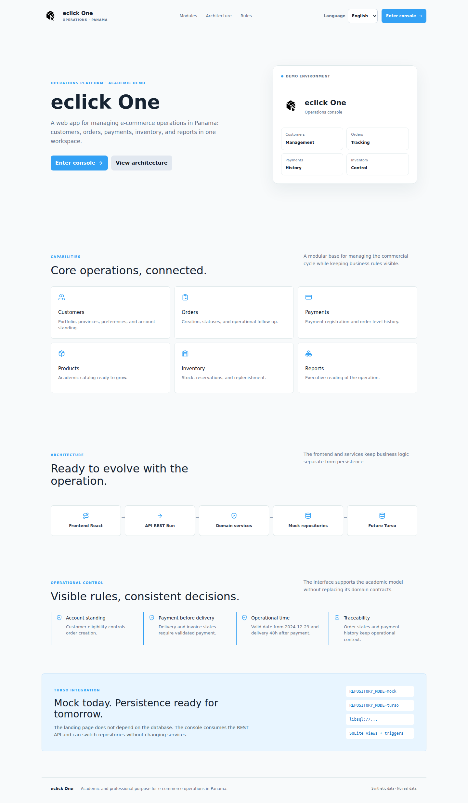

### System Requirements

- A modern desktop browser.
- For local development or demos: Bun 1.3+, the `.env` file, and the API/web stack running.
- For the full Web3 demo: Anvil, deployed contracts, and the Collector and Compliance agents.

### Accessing the Platform

For the default local experience:

1. Start the platform with `bun run dev`, `bun run dev:full`, or `docker compose up --build`.
2. Open the frontend in your browser:
   - `http://localhost:5173` for Vite development
   - `http://localhost` for Docker Compose
3. Open the login or register page.

### Logging In / Registering

New users can create an account from the register screen. Existing users sign in from the login screen.

Registration collects:

- first name
- last name
- email
- password
- password confirmation

Login collects:

- email
- password
- optional "remember" checkbox

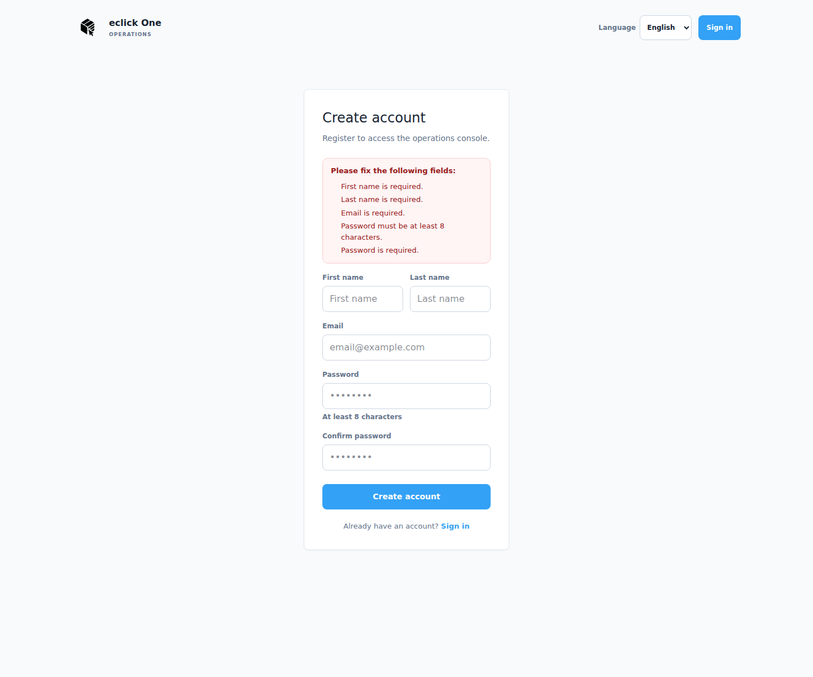

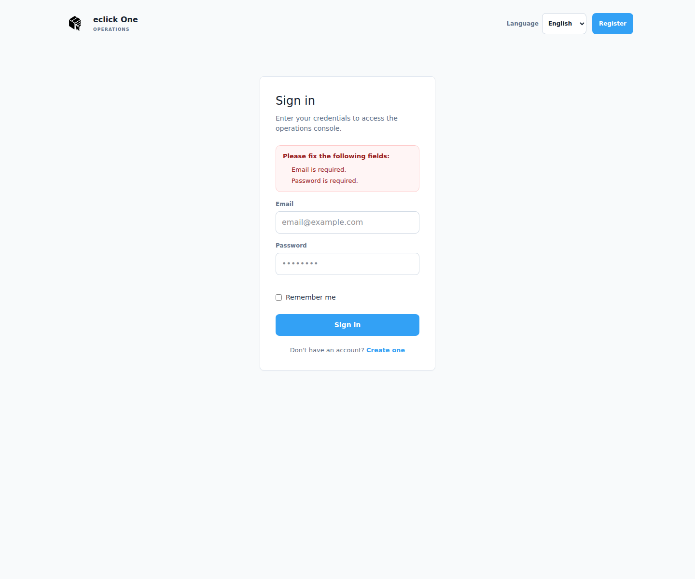

For demo mode, you can also use the seed credentials from the README:

- `demo.operator@eclick.one`
- `DemoSeedPassword-2026`

### Dashboard Overview

After signing in, the application opens on the Summary page. This is the main operational snapshot.

The dashboard shows:

- number of customers
- current orders
- collected amount
- customers not in good standing
- order status chart
- agent activity panel
- alerts about at-risk orders and non-compliant customers
- monthly order and payment summaries
- inventory summary
- top products

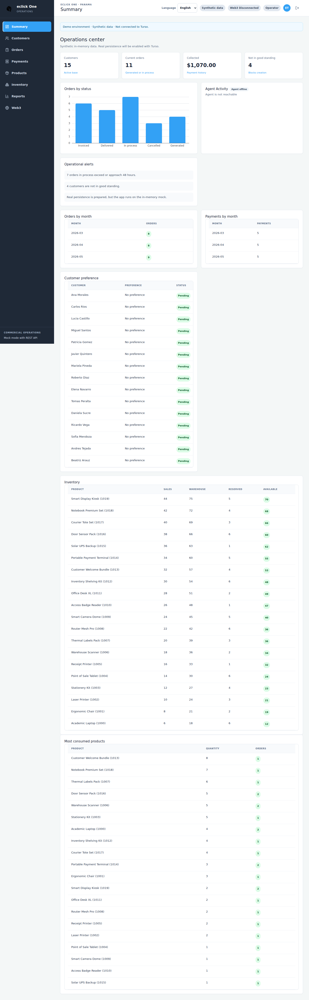

Header badges communicate environment state:

- `Synthetic Data` or `Azure SQL`
- `Web3 Connected` or `Web3 Disconnected`
- the current role

## Managing Customers

The Customers page combines customer creation, preference lookup, and the customer table.

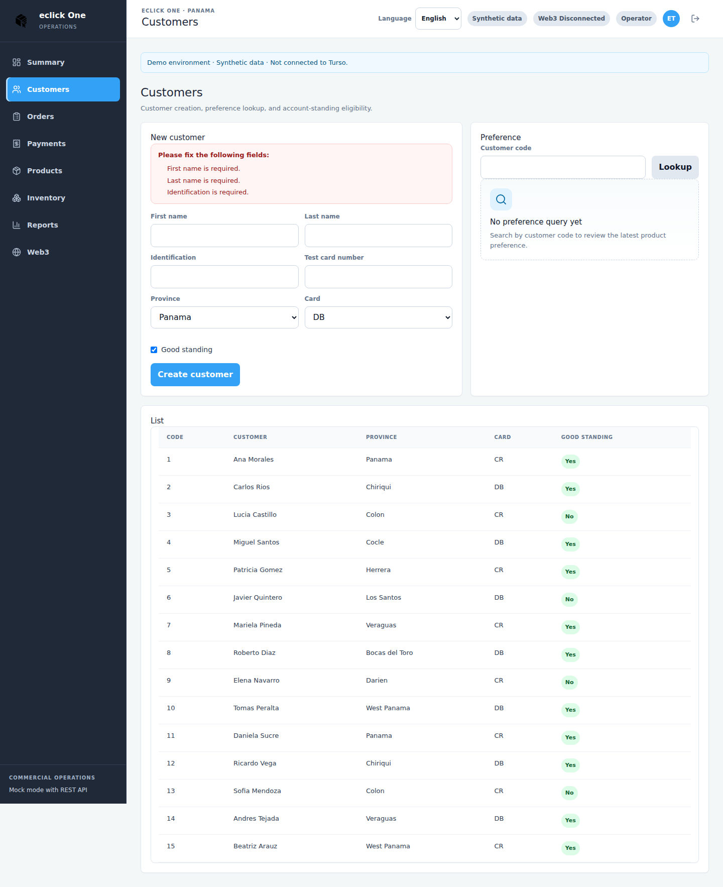

### Viewing Customer List

The lower table lists all customers currently available in the selected repository mode. Each row shows:

- customer code
- full name
- province
- card type
- good standing / paz y salvo status

### Creating a New Customer

Use the `New customer` panel.

Required fields:

- first name
- last name
- identification
- province
- card type

Optional or toggle fields:

- card number
- good standing / paz y salvo

Behavior to expect:

- inline validation appears before submit
- the success message appears above the page after creation
- the list refreshes immediately

### Searching Customers

The current MVP does not include a free-text search box for the customer list.

What you can do today:

- scan the customer table manually
- use the customer code field in the `Preference` panel to query a saved customer preference

This is important for training operators: "search" in the current UI means lookup by code for preference analysis, not full-table filtering.

### Understanding Paz y Salvo Status

`Good standing` in English and `Paz y salvo` in Spanish indicate whether a customer is eligible to create an order.

If a customer is not in good standing:

- the customer still appears in the list
- the dashboard counts the customer as non-compliant
- order creation for that customer is blocked by business rules

### Customer Preferences

The `Preference` panel returns the preferred product for a customer code when enough order history exists.

Rules:

- the system needs repeated demand before a preference is calculated
- if there is not enough history, the page returns a "no preference" message instead of forcing a result

## Managing Orders

The Orders page is split into three main areas:

- order creation
- status change for active orders
- current orders and order history tables

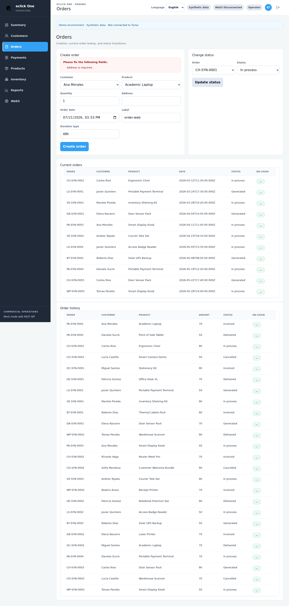

### Creating an Order

Use the `Create order` form and choose:

- customer
- product
- quantity
- address
- order date
- label
- duration type

Important rules:

- the selected customer must be paz y salvo / in good standing
- quantity must be a positive integer
- the order date cannot violate the configured date rules
- label, address, and duration type are required

Amounts are not typed manually. They are derived from quantity by the domain rules.

### Viewing Current Orders

The `Current orders` table shows orders in active states such as:

- `generado` / `generated`
- `proceso` / `in process`

This table is the fastest place to identify work still in progress.

### Order Status Transitions

Use the `Change status` panel to move an order through the allowed lifecycle.

Supported statuses:

- generated
- in process
- delivered
- cancelled
- invoiced

Rules to remember:

- not every state can jump to every other state
- delivered and invoiced require the order to be paid
- cancelled orders cannot be paid later

### Understanding On-Chain Status Badges

Both order tables render an `On-chain` badge.

Possible outcomes:

- `On-chain: ...` when a blockchain status is available
- `No on-chain` when no smart contract record is reachable
- `...` while the badge is loading

In a mock-only or offline blockchain session, seeing `No on-chain` is expected.

### Order History

The `History` table includes all orders, not only active ones. Use it to review:

- total amount
- final or current status
- on-chain badge

## Processing Payments

The Payments page combines payment registration, a table of payable orders, and payment history.

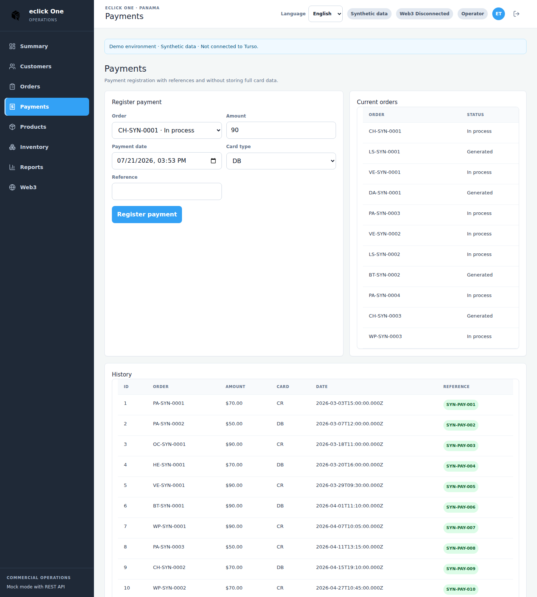

### Recording a Payment

Use the `Register payment` form.

Fields:

- order code
- amount
- payment date
- card type
- optional reference

Default behavior:

- when you select an order, the amount is prefilled with the expected order amount
- the page keeps you from saving an amount mismatch

### Supported Card Types

The MVP supports:

- `DB`
- `CR`

These values appear consistently in customers and payments.

### Viewing Payment History

The `History` table shows:

- payment ID
- order code
- amount
- card type
- date
- reference

### Payment Validation Rules

The platform validates:

- positive amount
- valid date
- card type present
- payment amount must exactly match the order amount
- payment cannot be registered for a cancelled order
- payment cannot be registered twice for the same already-paid order

## Products and Inventory

### Browsing the Catalog

The Products page is the simplest catalog view in the app.

It shows:

- product code
- product name
- category

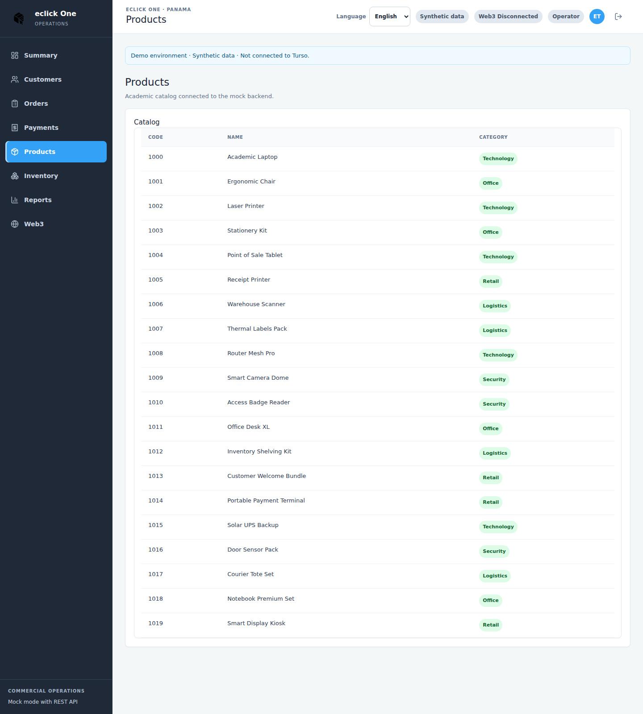

### Understanding Inventory Levels

The Inventory page exposes the operational stock summary.

Columns:

- product
- sales
- warehouse
- reserved
- available

`Available` is calculated as warehouse stock minus reserved stock.

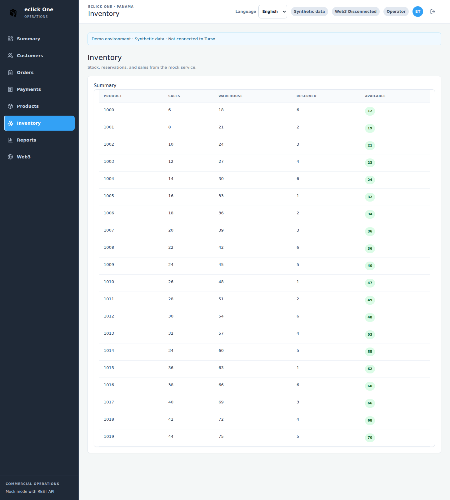

### Low Stock Alerts

The current MVP does not show a dedicated red "low stock alert" badge on the Inventory page.

How to monitor low stock today:

- compare `warehouse` vs `reserved`
- review the inventory summary on the dashboard
- use the operational context from reports

If a product has little available stock, operators should treat it as a manual replenishment signal.

### At-Risk Orders

At-risk orders are surfaced on the Summary page rather than the Inventory page.

An at-risk order typically means:

- it is still in process
- it is approaching or exceeding the 48-hour business expectation

Use the Summary page alert list first, then drill down to Orders.

## Reports

The Reports page renders multiple sections generated by the API.

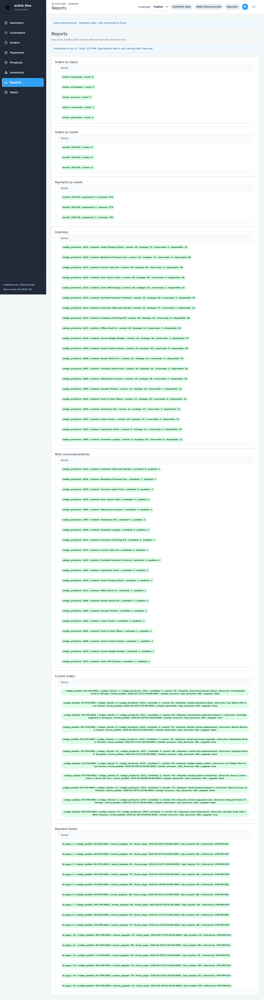

### Order Status Reports

One section summarizes how many orders exist in each status.

Typical statuses:

- generated
- in process
- delivered
- cancelled
- invoiced

### Monthly Reports

The page includes monthly summaries for:

- orders by month
- payments by month

These are useful for trend reading rather than transaction editing.

### Inventory Reports

Inventory data also appears as a report section, giving a read-only executive view of stock conditions.

### Top Products Report

The top products section highlights:

- the most consumed products
- quantity totals
- number of orders that used each product

### Exporting Data

The current MVP does not include a dedicated export button in the Reports screen.

Current operator guidance:

- use the browser for review and screenshots
- use the API if structured extraction is needed
- document manually when preparing a presentation or stakeholder review

## Web3 Dashboard

The Web3 page is designed for the demo and monitoring workflow rather than day-to-day data entry.

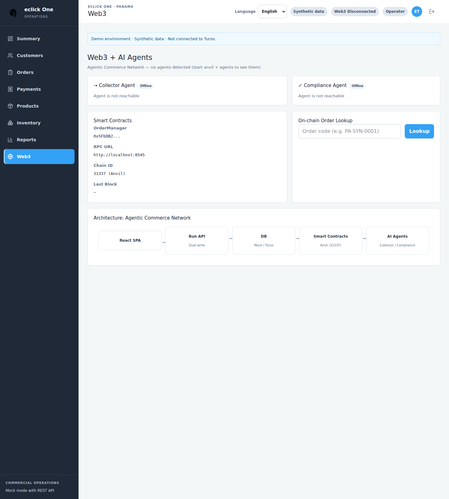

### Understanding the Web3 Dashboard

This page groups:

- Collector agent card
- Compliance agent card
- smart contract details
- on-chain order lookup
- architecture overview

### Agent Health Monitoring

Each agent card shows:

- online or offline badge
- description
- wallet
- metrics such as actions, errors, processed orders, average response time, and uptime
- recent activity

If an agent is offline, the card still helps explain what is missing.

### Smart Contract Information

The contract panel shows:

- OrderManager address
- RPC URL
- chain ID
- last known block

This is especially useful during local demos and troubleshooting.

### On-Chain Order Lookup

Operators can type an order code, such as `PA-SYN-0001`, into the lookup box.

Expected outcomes:

- a blockchain status is returned
- the order is reported as not found on-chain
- an error appears if the API or blockchain bridge is unavailable

### Blockchain Connection Status

There are two practical places to check blockchain readiness:

1. The top header badge:
   - `Web3 Connected`
   - `Web3 Disconnected`
2. The Web3 page itself:
   - agent online/offline badges
   - contract and lookup responses

If the stack is running without agents, the Web3 page still loads, but it will present the offline state.

## Bilingual Support

The platform supports English and Spanish.

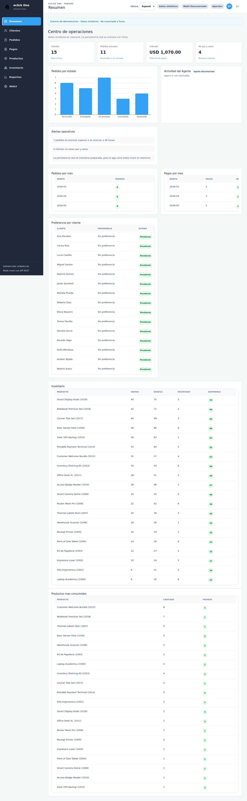

### Switching Languages

Use the language selector in:

- the public header on Login and Register
- the application header after signing in

Steps:

1. Open the language selector.
2. Choose `English` or `Spanish`.
3. The current screen updates immediately.

### Language Preferences

The language choice is intended for operator convenience in the browser session. The app can also default from the browser language when available.

Operational advice:

- train each operator in the language they will actually use day to day
- keep bilingual teams aligned with the terminology reference at the end of this manual

## Troubleshooting

### Common Issues and Solutions

`I cannot create an order`

- Check whether the customer is marked as paz y salvo / good standing.
- Check that quantity is positive.
- Check that date, label, and address are filled.

`I cannot move an order to delivered or invoiced`

- Confirm the order has already been paid.
- Confirm the transition is valid from the current status.

`I cannot register a payment`

- Verify the amount exactly matches the order amount.
- Verify the order is not cancelled.
- Verify the order has not already been paid.

`Web3 shows offline`

- This is expected if agents or local blockchain services are not running.
- Start the full stack when you need a live blockchain demonstration.

`Reports do not export`

- The MVP has no built-in export button yet.
- Use API access or manual capture when an export is required.

`Customer search is missing`

- The current MVP does not include free-text customer search.
- Use the customer table and preference lookup by code instead.

### Getting Help

For the current repository, start with:

- `README.md` for setup and demo commands
- `docs/deployment-guide.md` for environment and runbook details
- the Web3 page for local agent and contract visibility

### Reporting Bugs

When reporting a bug, include:

- the page name
- the language in use
- the order/customer/payment code involved
- the exact validation or error message
- whether you were in mock mode or a SQL-backed mode
- whether Web3 services were online

## Bilingual Terminology Reference

| English | Spanish | Notes |
|---|---|---|
| Summary | Resumen | Main dashboard page |
| Customers | Clientes | Customer module |
| Orders | Pedidos | Order module |
| Payments | Pagos | Payment module |
| Products | Productos | Product catalog |
| Inventory | Inventario | Stock view |
| Reports | Reportes | Executive report sections |
| Good standing | Paz y salvo | Customer eligibility to order |
| Label | Etiqueta | Order label field |
| Current orders | Pedidos actuales | Active orders table |
| History | Historial | Historical record table |
| Amount | Monto | Monetary value |
| Reference | Referencia | Optional payment reference |
| On-chain | En cadena | Smart contract status context |
| Web3 Connected | Web3 conectado | Header connectivity badge |
| Web3 Disconnected | Web3 desconectado | Header offline badge |
| Mock / Synthetic Data | Datos sinteticos / mock | Demo repository mode |

## Screenshot Regeneration

The screenshots embedded in this manual are committed under `docs/screenshots/`.

To regenerate them on Ubuntu without changing system packages:

```bash
bash scripts/capture-user-manual-screenshots.sh
```
